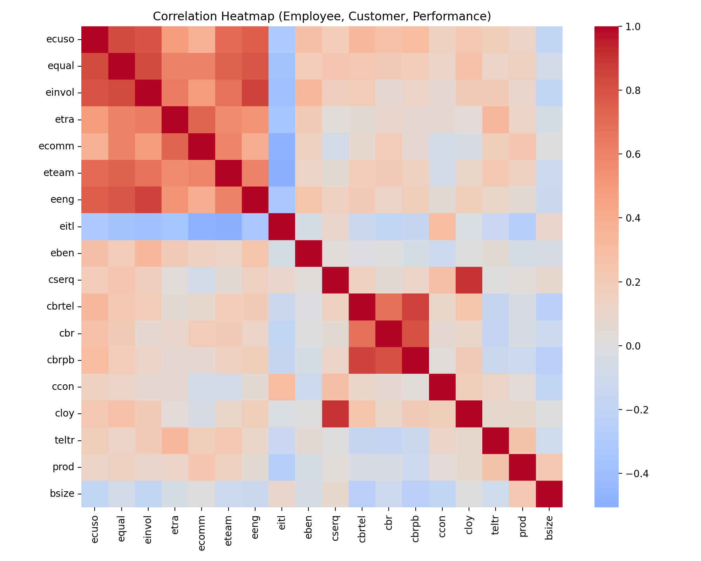
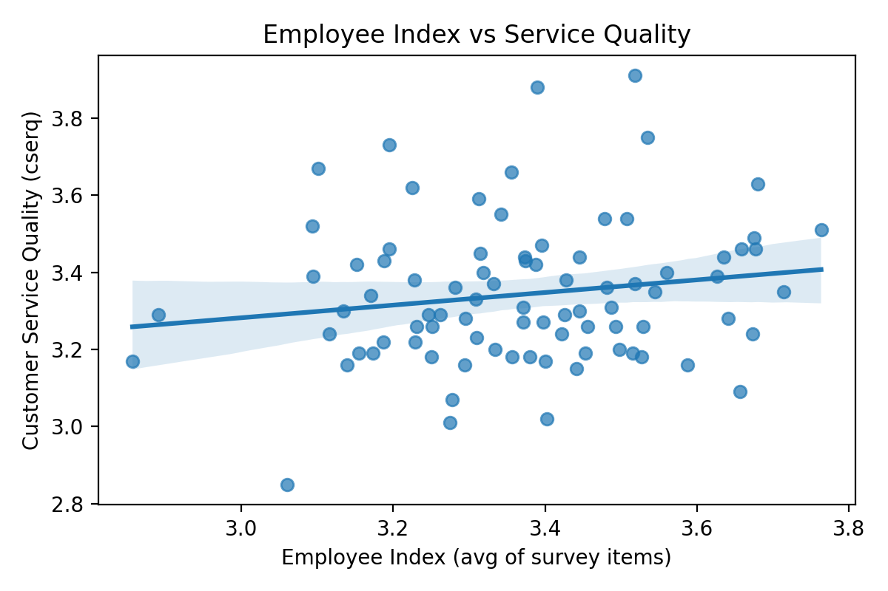
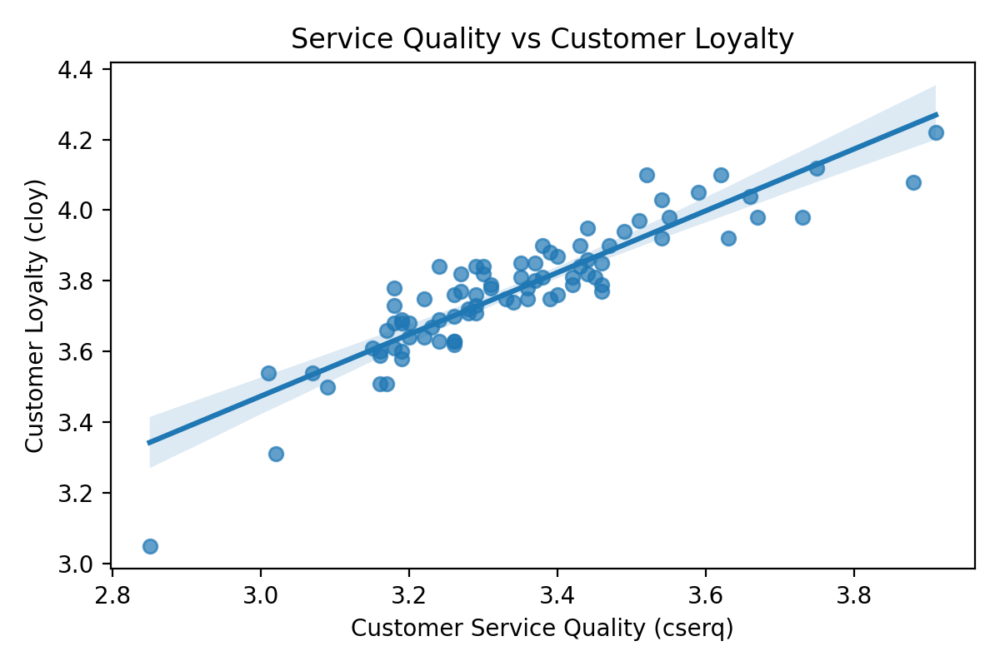
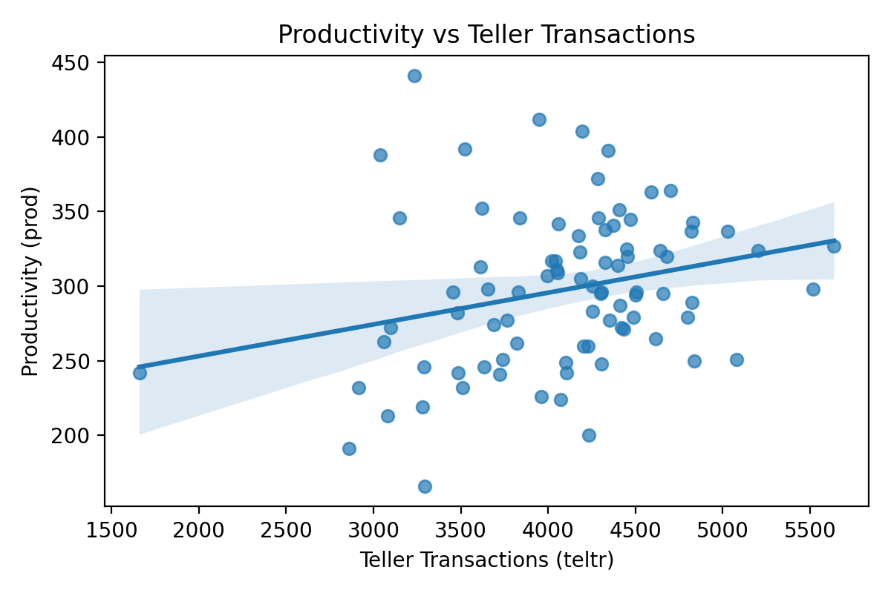
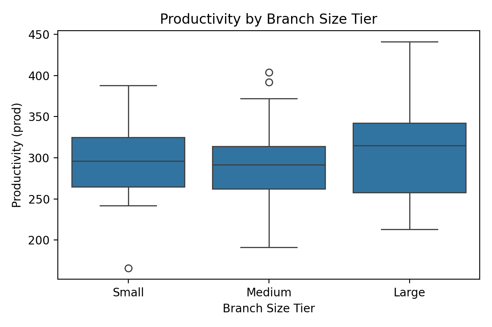

# Analyzing the Employee-Customer Performance Chain: A Branch-Level Study of National Choice Bank

Authors: Mohd Shoaib; Bejjanapala Puppala

Date: 04/30/2026

## Abstract
This study evaluates the relationship between employee perceptions, customer outcomes, and branch performance at National Choice Bank (NCB). A branch-level dataset integrating employee survey items, customer satisfaction metrics, and operational indicators is analyzed for 85 branches. Descriptive statistics, correlation analysis, regression models, and clustering are used to test the employee-customer-performance chain. The employee index exhibits a weak association with service quality ($r = 0.164$), whereas service quality is strongly associated with customer loyalty ($r = 0.904$). Models predicting loyalty perform well ($R^2 = 0.805$ to $0.828$), while productivity models show poor fit (negative $R^2$). Clustering yields three branch profiles, including a high-activity cluster with stronger productivity and a low-activity cluster with weaker outcomes. The evidence suggests that service quality is the most reliable lever for loyalty, while productivity is influenced more by operational throughput than by perceptions alone. The paper concludes with implications for service management, targeted employee initiatives, and operational capacity planning.

Keywords: employee engagement; service quality; customer loyalty; branch performance; banking analytics

## 1. Introduction
Retail banking performance is shaped by repeated service encounters at the branch level. NCB collects employee and customer survey data, yet these data are often examined separately from operational indicators. This study integrates those sources to address the following question: how do employee perceptions relate to customer outcomes, and how do those outcomes relate to branch performance?

The analysis is anchored in the employee-customer-performance chain, which posits that internal workforce conditions influence service quality and loyalty, and in turn affect performance. Empirical evidence on the strength of each link is required for targeted investment in training, communication, and service delivery. By quantifying these relationships with branch-level data, the study aims to support data-driven decision making for branch management and resource allocation.

## 2. Literature Review
The service-profit chain provides the theoretical foundation for the study. Heskett et al. (1994) show that employee satisfaction influences service quality and customer satisfaction, which then drives profitability. Wiley (2010) reports that employee engagement predicts customer satisfaction across industries. Salanova et al. (2005) demonstrate that engagement improves service quality in customer-facing roles. Bowen and Schneider (2014) emphasize internal service climate, such as communication and teamwork, as a driver of customer loyalty. Yee, Yeung, and Cheng (2008) confirm these relationships in retail banking, linking engagement, service quality, and loyalty.

Collectively, the literature supports the hypothesis that improvements in employee perceptions can translate into better customer outcomes and business performance. This study tests that hypothesis using NCB branch-level data.

## 3. Data and Preprocessing
### 3.1 Data Description
The file NCB_filtered_data_2025-11-26 (2).csv contains 85 branches and 21 variables. The data are aggregated at the branch level and, according to project documentation, originate from employee surveys (approximately 2,200 responses), customer evaluations (approximately 14,000 responses), and operational performance metrics. Key variables include:

- Employee perceptions: customer orientation (ecuso), fairness and equality (equal), involvement (einvol), training (etra), communication (ecomm), teamwork (eteam), engagement (eeng), leadership and IT support (eitl), and benefits (eben).
- Customer outcomes: service quality (cserq), branch reputation metrics (cbr, cbrtel, cbrpb), convenience (ccon), and loyalty (cloy).
- Performance: teller transactions (teltr), productivity (prod), and branch size (bsize).

All branches in the provided file are labeled Metro, so geographic comparisons are not feasible in this dataset.

### 3.2 Data Cleaning and Feature Engineering
- Missing values were checked and none were detected.
- Column names were standardized to lower case.
- An employee index was constructed as the mean of the nine employee perception variables.
- A customer index was constructed as the mean of service quality, reputation, and convenience variables (excluding loyalty).
- Size tiers (Small, Medium, Large) were created using terciles of branch size.
- Predictors were standardized within models using z-scores.

## 4. Methodology
### 4.1 Descriptive Analytics
Central tendency and dispersion were computed to establish baseline performance. Outcomes were also compared across size tiers to assess whether operational scale is associated with systematic differences in outcomes.

### 4.2 Correlation Analysis
Pearson correlations among employee, customer, and performance variables were computed to evaluate linear associations prior to modeling.

### 4.3 Predictive Modeling
Three model families were estimated using an 80/20 train-test split (random seed 42):

1. Employee perceptions to customer service quality (cserq)
   - Linear regression
   - Random forest regression
2. Customer service quality and related metrics to customer loyalty (cloy)
   - Linear regression
   - Random forest regression
3. Customer outcomes and operational variables to productivity (prod)
   - Linear regression
   - Random forest regression

Models were evaluated with $R^2$, RMSE, and MAE.

### 4.4 Clustering
K-means clustering was applied to standardized employee index, customer index, productivity, and teller transactions. Candidate solutions with $k=2$ to $k=5$ were assessed, and the best silhouette score determined the final solution.

## 5. Results and Model Comparison
### 5.1 Descriptive Statistics
Table 1 provides descriptive statistics for the primary indices and performance metrics.

Table 1. Descriptive statistics (branch-level)

| Metric | Mean | Std | Min | Max |
|---|---:|---:|---:|---:|
| Employee Index | 3.370 | 0.186 | 2.857 | 3.763 |
| Service Quality (cserq) | 3.343 | 0.185 | 2.850 | 3.910 |
| Customer Loyalty (cloy) | 3.774 | 0.179 | 3.050 | 4.220 |
| Productivity (prod) | 297.459 | 52.310 | 166.000 | 441.000 |
| Teller Transactions (teltr) | 4085.353 | 637.611 | 1660.000 | 5637.000 |
| Branch Size (bsize) | 17.906 | 9.464 | 5.000 | 55.000 |

Table 2 reports outcomes by branch size tier.

Table 2. Size tier means

| Size Tier | eeng | cserq | cloy | prod | teltr |
|---|---:|---:|---:|---:|---:|
| Small | 3.387 | 3.324 | 3.787 | 294.103 | 4246.552 |
| Medium | 3.219 | 3.332 | 3.742 | 290.893 | 4019.000 |
| Large | 3.237 | 3.373 | 3.791 | 307.500 | 3984.750 |

### 5.2 Correlations
The correlation results provide partial support for the employee-customer-performance chain:

- Employee index vs service quality: $r = 0.164$ (weak positive)
- Service quality vs loyalty: $r = 0.904$ (strong positive)
- Loyalty vs productivity: $r = 0.087$ (weak positive)
- Teller transactions vs productivity: $r = 0.259$ (modest positive)

### 5.3 Model Performance
Table 3 summarizes test-set performance. Linear regression is marginally better than random forest for service quality, while random forest performs slightly better for loyalty. Productivity models exhibit poor fit, suggesting that productivity is not well explained by the available predictors.

Table 3. Model performance (test set)

| Target | Model | RMSE | MAE | $R^2$ |
|---|---|---:|---:|---:|
| Service Quality (cserq) | Linear | 0.196 | 0.155 | 0.176 |
| Service Quality (cserq) | Random Forest | 0.200 | 0.152 | 0.148 |
| Customer Loyalty (cloy) | Linear | 0.089 | 0.076 | 0.805 |
| Customer Loyalty (cloy) | Random Forest | 0.084 | 0.069 | 0.828 |
| Productivity (prod) | Linear | 56.634 | 36.904 | -0.225 |
| Productivity (prod) | Random Forest | 63.509 | 40.958 | -0.541 |

In the service-quality model, the largest standardized coefficients correspond to fairness and equality (positive), communication (negative), teamwork (negative), customer orientation (negative), and training (positive). Mixed signs likely reflect multicollinearity across employee survey measures.

### 5.4 Clustering Results
The best clustering solution uses $k=3$ with a silhouette score of 0.234. Table 4 presents centroid profiles and cluster sizes.

Table 4. Cluster centroids and sizes

| Cluster | Size | Employee Index | Customer Index | Productivity | Teller Transactions |
|---|---:|---:|---:|---:|---:|
| 0 | 34 | 3.296 | 3.189 | 335.618 | 4355.618 |
| 1 | 28 | 3.537 | 3.384 | 295.321 | 4243.143 |
| 2 | 23 | 3.277 | 3.205 | 243.652 | 3493.739 |

Cluster 0 represents a high-activity group with the strongest productivity and transaction volume. Cluster 1 has the highest employee and customer index values but only mid-level productivity. Cluster 2 exhibits weaker performance and lower transaction volume.

### 5.5 Figures
Figure 1. Correlation heatmap

Figure 2. Employee index vs service quality

Figure 3. Service quality vs customer loyalty

Figure 4. Productivity vs teller transactions

Figure 5. Productivity by branch size tier

## 6. Model Evaluation and Validation
Models were evaluated on a holdout test set (80/20 split, random seed 42). Service quality models show low $R^2$, indicating limited explanatory power from employee survey measures alone. Loyalty models are strong, with $R^2$ above 0.80, consistent with the high correlation between service quality and loyalty. Productivity models return negative $R^2$, indicating that the predictors do not capture the dominant drivers of productivity in this dataset.

Future validation should include repeated k-fold cross-validation and robustness checks using alternative feature sets, operational lag variables, and external market controls.

## 7. Business Implications
1. Service quality is the primary lever for loyalty. The strong service quality-loyalty association indicates that investments in service delivery are likely to yield the most immediate retention benefits.
2. Employee perceptions exhibit limited direct association with service quality in this dataset. Broad engagement scores may not translate into measurable service gains unless linked to specific behaviors and coaching interventions.
3. Productivity is driven by operational throughput. The modest association between teller transactions and productivity suggests that capacity planning and process efficiency are more actionable levers than perception metrics alone.
4. Branch profiles differ materially. The cluster results indicate the need for differentiated interventions by branch profile rather than uniform policies.

## 8. Limitations
- The dataset is aggregated at the branch level, limiting insight into individual-level mechanisms.
- All branches are labeled Metro, preventing geographic comparisons.
- The data are cross-sectional, so causal claims cannot be made.
- Employee survey variables are highly correlated, reducing coefficient interpretability in multivariate models.
- Productivity likely depends on external factors not captured in the dataset (market size, competitive intensity, digital adoption, staffing mix).

## 9. Conclusion
The analysis confirms a strong link between service quality and customer loyalty at NCB, but a weaker connection between employee perceptions and service quality. Productivity appears to be driven more by operational throughput than by survey-based perceptions. These findings imply that NCB should prioritize service quality management and operational efficiency while using employee data to target specific process and training improvements. A more complete understanding of the employee-customer-performance chain will require richer operational data and repeated analyses over time.

## 10. References
Bowen, D. E., and Schneider, B. (2014). A service climate synthesis and future research agenda. Journal of Service Research.

Heskett, J. L., Jones, T. O., Loveman, G. W., Sasser, W. E., and Schlesinger, L. A. (1994). Putting the service-profit chain to work. Harvard Business Review.

Salanova, M., Agut, S., and Peiro, J. M. (2005). Linking organizational resources and work engagement to employee performance and customer loyalty: The mediation of service climate. Journal of Applied Psychology.

Wiley, J. W. (2010). Strategic employee surveys: Evidence-based guidelines for driving organizational success. Jossey-Bass.

Yee, R. W. Y., Yeung, A. C. L., and Cheng, T. C. E. (2008). The impact of employee satisfaction on quality and profitability in high-contact service industries. Journal of Operations Management.

## 11. Reproducibility Appendix
### 11.1 Files
- Project repository: https://github.com/puppalabejjanapala193-ship-it/ncb-employee-customer-performance-chain
- analysis.py: End-to-end analysis script (models, tables, figures)
- requirements.txt: Python package list
- figures/: Output directory for figures and CSV tables

### 11.2 How to run
1. Install packages:
   - pip install -r requirements.txt
2. Run the analysis:
   - python analysis.py
3. Outputs:
   - figures/fig1_correlation_heatmap.png
   - figures/fig2_employee_vs_service.png
   - figures/fig3_service_vs_loyalty.png
   - figures/fig4_prod_vs_teltr.png
   - figures/fig5_prod_by_size.png
   - figures/table_size_summary.csv
   - figures/table_cluster_summary.csv
   - figures/analysis_results.json

### 11.3 Model parameters
- Train-test split: 80/20, random seed 42
- Random forest: 300 trees, min_samples_leaf = 2
- K-means: $k=2$ to $k=5$, best silhouette selected
